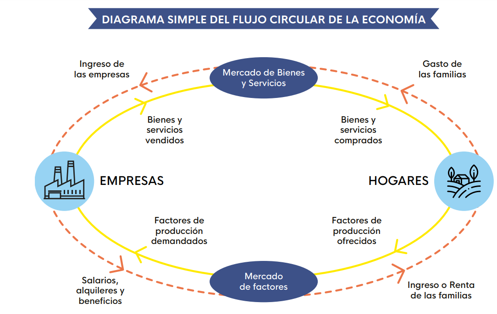

```{r setup, include=FALSE}
options(htmltools.dir.version = FALSE)
knitr::opts_chunk$set(
  fig.width=6, fig.height=3.5, fig.retina=3,
  out.width = "100%",
  cache = FALSE,
  echo = FALSE,
  message = FALSE, 
  warning = FALSE,
  hiline = TRUE,
  dev = "png", 
  dev.args = list(type = "cairo-png")
)
library(ggplot2)
library(showtext)
font_add_google("Lato", "Lato")
font_add_google("Merriweather", "Merriweather")
theme_set(theme_minimal(base_family = 'Lato', base_size=16))
```


```{r xaringan-themer, include=FALSE, warning=FALSE}
library(xaringanthemer)


colores <- c(celeste="#5e82ae", 
             color3="#89a2c3",
             color1="#698BB4",
             color2="#5D81AD",
             verde="#4E7B7B")

# ,,5D81AD,,000000
style_mono_accent(
  base_color = "#5e82ae",
  #secondary_color = "",
  header_font_google = google_font("Lato"),
  text_font_google   = google_font("Merriweather"),
)
```


<!-- <style> -->

<!-- li { -->
<!--   margin-bottom: 20px; -->

<!-- } -->

<!-- .remark-slide-content { -->

<!--  height: 200px; -->
<!-- } -->

<!-- li { -->
<!--   margin-bottom: 20px; -->
<!-- } -->
<!-- </style> -->


# Introducción a la Economía


- Jueves  9:10 - 9:50
- Viernes 7:45 - 9:05

---
# Docente

- Rafael La Buonora (rafael.labuonora `r emo::ji("e-mail")`) 

- Economista
  - Ministerio de Industria
  - Ministerio de Economía
  - Oficina de Planeamiento y Presupuesto


---
# Objetivos del curso

- Presentar las principales herramientas de la ciencia economómica para entender el mundo.
- Dar un panorama de qué hacen los economistas.

---

# Recursos (1)

.pull-left[
- Google Classroom 
- [Sitio web](https://econ.rlabuonora.com)

  - Ejercicios
  - Notas de clase
  - Libro Microeconomía (Parkin y Loría)
]

.pull-right[
    
]


---
# Evaluación

- Participación en clase (50%)

- Pruebas Escritas (50%)

  - 2 escritos
  - 2 parciales

---

# ¿Qué estudia la economía?

- ¿Por qué algunos países son más ricos que otros?

- ¿Cómo se determina el salario de los trabajadores?

- ¿Qué medidas debe tomar el gobierno para mejorar el bienestar de la población?

- ¿A quién beneficia una política económica?

---

# Contenido del curso

- Microeconomía

  - Consumidores
  - Productores
  - Mercados
  - Mercado de Trabajo
  - Distribución del Ingreso
  
- Macroeconomía

  - Actividad Económica
  - Desempleo
  - Inflación
  - Dólar y Comercio Exterior

---

# Problemas económicos de la sociedad

- ¿Qué producir?

Economías con __estructura productivas__ diferentes.

- ¿Cómo producir?

Economías disponen de diferentes __tecnologías__.

- ¿Para quién producir?

__Distribución__ del producto de la economía.

---

# Economía Positiva y Normativa

- Positiva describe la realidad

- Normativa aplica juicios de valor

- ¿Es posible separalas?

---
# Economías Mixtas

- Las economías modernas don __economías **mixtas**__ 
- Combinan dos mecanismos para asignar recursos:

  - El mercado
  - El estado

---

# El mercado

.pull-left[

- Reúne compradores (demanda) y vendedores (oferta).

- Coordina millones de agentes __descentralizadamente__.

- Determinan el precio de un bien y la cantidad vendida

]

.pull-right[
  
]


---
# Mercado y Precios 

.pull-left[


]

.pull-right[

- El primero en entender la importancia de los mercados.

- Los precios son señales para que los agentes tomen decisiones.

- Determinan qué, cómo y para quién se produce.

]


---
## El mercado como mecanismo de asignación de recursos


- No hay un individuo o empresa responsable de "hacer funcionar" los mercados. Hay mercados de muchos tipos (centralizados, descentralizados, electrónicos, etc.).

- El rol de los mercados es determinar los **precios** y las **cantidades** que se compran de cada bien en la economía (autos, toneladas de celulosa, clases de economía).

- Estos precios sirven como **señales** para los agentes económicos, y son imprescindibles para **coordinar** su acción.

- El **equilibrio** de mercado es una combinación de precios y cantidades que haya un balance entre oferta y demanda, y que no se produzca de más ni de menos.

---
## El mercado como mecanismo de asignación de recursos (2)

- Los mercados son una forma de determinar
  - ¿Qué producir? Si nadie compra algo, el productor recibe una señal de que no es socialmente deseable destinar recursos a su producción.
  
  - ¿Cómo producir? Una nueva tecnología de producción será adoptada si aumenta más los ingresos que los costos.
  
  - ¿Para quién producir? Los ingresos de los miembros de una sociedad se determinan por los precios de los factores productivos que poseen.
  
  
---
## El mercado como mecanismo de asignación de recursos (3)

- Los principales fuerzas que determinan el funcionamiento de la economía: las preferencias y la tecnología.

- Las preferencias son los gustos de los consumidores, y determinan donde nos vamos a parar en la FPP.

- La tecnología determina los límites de lo que podemos producir con los factores productivos que poseemos.


---
# El rol del Estado

.pull-left[

En una economía mixta, el Estado es necesario cuando:
- Resultados ineficientes
- Resultados eficientes pero injustos
- Estabilidad macroeconómica
]

.pull-right[
  
]

---
# Competencia Imperfecta

Los oferentes o los demandantes tienen __poder de mercado__.


 
 
---
# Competencia Imperfecta (2)

.pull-left[
     
]

.pull-right[
  
]

---
# Externalidades

La actividad económica genera efectos que no se reflejan en los precios.

.pull-left[
  
]

.pull-right[
  

]

---
class: center
# Bienes Públicos

No es posible excluir personas de su consumo


---
class:center

# Desigualdad


-Algunos resultados pueden ser eficientes pero injustos


---
# Estabilidad Macroeconómica

El nivel de actividad, el empleo y el nivel general de precios.

.pull-left[
  - Política Fiscal (Ministerio de Economía)
  
]

.pull-right[
  - Política Monetaria (Bancos Central)
  
  
]


---
# Método: ¿Cómo estudia la economía?

- La economía como ciencia.
- Matemática: el lenguaje de la ciencia.

---
# Variables

- Las ventas de una empresa (precios, cantidades, ventas).
- La cantidad de empleos en una economía.
- El valor de las exportaciones de un país.

---
# Ecuaciones

$$ Beneficios = Ingresos - Costos $$

$$ Consumo = f(Ingreso) $$

---
# Funciones

$$ Producción = f(Trabajadores) $$
$$ Demanda = Q_d(Precio, Ingresos, ...) $$


---
# Datos y gráficas (1): Líneas


---

# Datos y gráficas (3): Barras


---

# Datos y gráficas: (4)


---


# Datos y gráficas: (6) Puntos


---

# Datos y gráficas (7): Puntos


---
# El diagrama del flujo circular

.pull-left[
  -Es un esquema de como se relacionan los agentes de la economía.
  - Aparecen los hogares, y las empresas.
  - Se vinculan a través de mercados.

]

.pull-right[
  

]